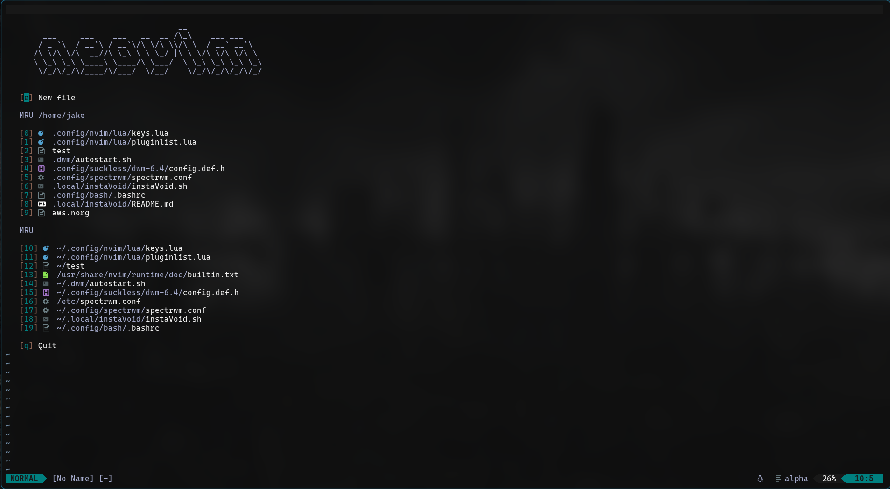
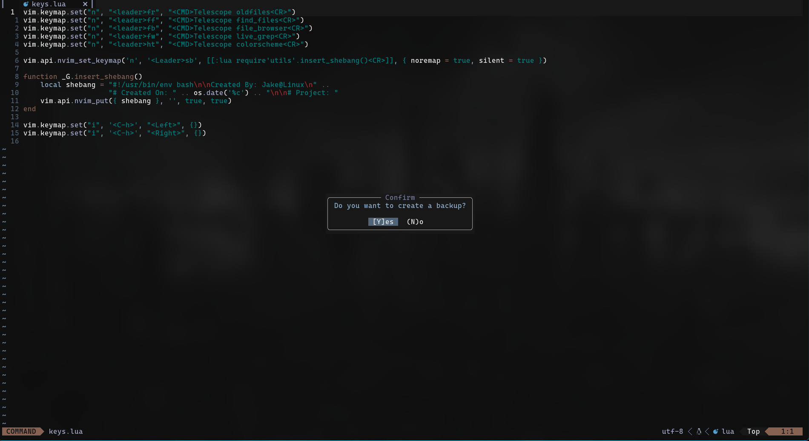

# My Neovim Config

- Currently manage my plugins using Lazy.nvim
- Modular structure allows for easy editing and customizing 
- Keymap set in keys.lua to allow for movement within file while still in insert mode using the hjkl
- Bonus custom lua script to prompt for user to select if they want to create a backup of the current file when they write. If user selects yes, it not only saves the current file, but 
creates a second copy of the file as a backup in a completely different directory, if no is selected, then only the current file is saved and no backup is created.

### Favorite Plugins
* Telescope
* Noice
* Neorg
* barbar
* alpha

### Colorschemes
Palettes have been slightly modified to match my personal colorscheme, just until I get a chance to write my own scheme
* Poimandres
* Rams
* Monochrome
* Jake (custom theme, currently set)
